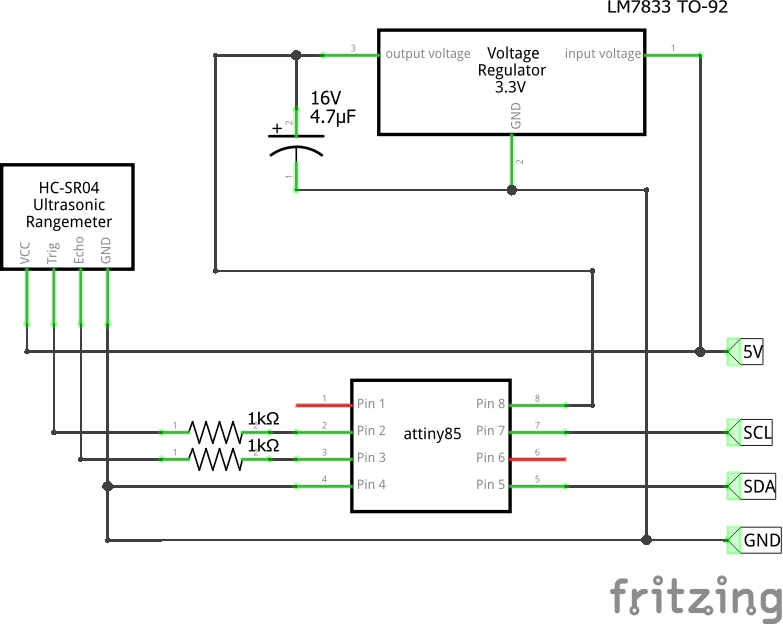

# I2C interface for HC-SR04 and US-100 sonar rangefinder

Most modern flight controllers does not allows to connect HC-SR04 and US-100 rangefinders. Reason in quite simple: not enough pins for quite low priority device. 

This interface can be used to connect HC-SR04 and US-100 sonar rangefinder to boards equipped with I2C bus and running latest versions of INAV. 

## US-100 instead of HC-SR04

**US-100** is superior to HC-SR04 in almost all areas. While HC-SR04 interface is doable, it is _HIGHLY_ recommended to use US-100 instead! 

On a hardware level, connection is the same: Echo and Trigger pin. Condition is to switch US-100 to _trigger/echo_ by removing a jumper in be back of the board. When jumper is removed, US-100 will behive almost exactly like HC-SR04.  

## Diagram

## Notes

* HC-SR04 is 5V, while STM32 CPU are 3.3V devices and might not tolerate 5V on I2C lines. This is why, you either have to run ATtiny on 3.3V or run it on 5V too (remove inline resistors) but connect using logic level shifters
* US-100 can work in both 3.3V and 5V mode. 3.3V mode was not tested, that is why inline resistors are in place
* You can remove 3.3V stabilizer and take 3.3V from flight controller too
* Latest Arduino IDE (suggested 1.8.x, should work with older)
* [ATtiny Universal](https://github.com/SpenceKonde/ATTinyCore) ATtiny core files
* [TinyWireS](https://github.com/rambo/TinyWire/tree/master/TinyWireS) library
* IPS programmer. I use USBasp, but even Arduino as ISP can be used
* [ATtiny flashing guide](https://quadmeup.com/programming-attiny85-and-attiny45-with-arduino-ide/)

03/12/2017: code modified to run on Arduino Pro Mini 3.3V 8MHz
